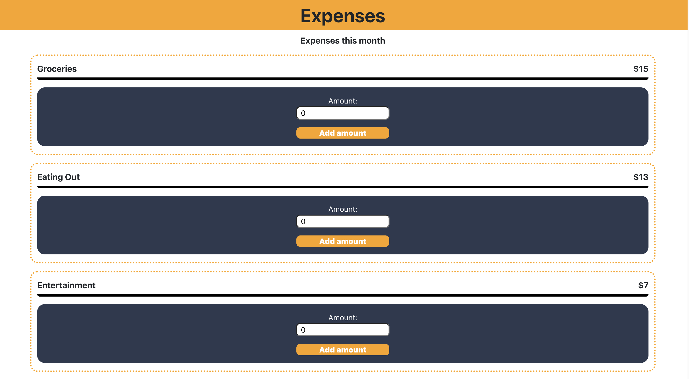

# Budget Manager 

**Deployment**
- [Budget Netifly](xxx)
- [Budget Heroku](xxx)
---
**Repositories**
- [FrontEnd Budget_Manager](https://github.com/montse-velazquez/Budget)
- [BackEnd Budget_Manager](https://github.com/montse-velazquez/backEnd_budgetManager)
---
**Project**
- [Trello](xxx)

### Purpose 
The purpose of Budget Manager is to keep track of expenses and savings as the mainfunctions, since keeping track of those to thing will give us a better perspective of how our money is being moved. Adding other functions will enhance the user experience however is not really needed. 

In the case of the project there was a couple of functions planned for the app, however not all of them were able to be created, as the time was tight i decided to keep it short and stick with the main two features of the app:
- **Manage Goals** (Create, Update, Delete, Read)

Saving Goals is one of the main features of the app as it is the one that will be keeping track of how much money we are saving for different purposes. Each person has a different goal for saving money, so we can not set default name for the different savings accounts since people might not be saving at the moment for a car (an example), that's why I have decided to give the freedom to users for selecting the name of their savings account as each user has different needs.

- **Manage Expenses** (Create, Read)

Another main feature of the app, as it is the page that keeps track of all the expenses and also lets us know how much we have spent on each category, for this project we have created default categories as in this case, it is more predictable to tell what kind of expenses a user has as they are more related to expenses of our daily routine like groceries, eating out, shopping, etc.

---
---
Inside of the other features that were planned on the project was:
- **Automated Bills**

Automated Bills are an extra feature for this app as it is not crucial, however, is plus on the app, as it allows us to keep in mind those expenses that happen on a weekly, monthly or yearly basis, an easy example of this is paying for rent every 1st of the month, or for some students it can also be paying for their tuition every month, bills like power, gas, subscriptions, etc. All these kinds of expenses that have been already settled can be registered on this side of the app, as the user will be able to name, categorise it, add the amount, the next payment day and how often the bill will be, so the app can keep track if it will be an expense of every month, etc.

- **Money In/Out**

Money In/Out is an extra feature as well, this feature can be seen also as a summary of all four features, in this page we can only view how much money is in, and how much money has been out so far, keeping on mind that it will stop tracking at the end of the month for restarting the expenses again.

This features were unable to be deployed as plenty of problems appeard once we started working deeper on each of the main features, as well as big changes and decisions were made in the last couple of weeks. 

## Libraries 

- **React**

React is JavaScript library that was used for building user interfaces. It allowed to create reusbale UI components and to manage their state in a clear and efficient way. While using React one of the perks was React takes care of updating the UI when the changes are done in the moment, so being able to realize about every single error before hand was useful as they could be fixed in that moment since react will not let to proceed the App. 

Even though React only renders the changes done in the moment and not the entire UI, is useful as we keep running the server while working on different functions, thats why was crucial to not being jumoing from one function to another one before being sure that the function was running correctly. 

Inside of React there is plenty of other libraries that were used along this project like, React Router is a popular library used for routing React apps, it create a client-side routing by using simple routes from API, where each route will e rendering a different component of Budget Manager as each routes manages different functions or if the case they share some CRUD actions in the same routing as it can be expected from a proper API where a single route can produce different actions based on their HTTPS request. 

The usage of **React Router** in the project was for creating a single-page application that provides access to different routes and funtiones all rendered in a single page **'App'** 

- **Express**

Express is a framework from Node.js both used for creating the server-side of the application, while **Node.js** manages the JS runtime environment, Express creates and handles API's, including routing and middleware. Inside of the project there were several routes with different HTTPS request each with a different functionality. Express was able to run and be tested through Insomnia while in development by finally being tested by **Jest**. While Express is able to create an API and generate HTTPS request, is often used with other techologies as databases like **MongoDB** in this case MongoDB was our library to go with for this project however due to a connection error the API and database were unable to be connected. 

Till today i keep troubleshooting this error as i havent being able find a solution as is unable to connect either to a localhost or to the cloud environment that was properly created. Troubleshooting like trying to connect through different networks were realized as well as restaring laptop, network, etc. Everything lead to an unsuccessfull deployment from the database. 

- **MongoDB**

Mongo is a NoSQL database, commonly used for MERN stack applications like 'Budget Manager'. It an easy database to use, even though the server-side is not properly connected, it possible to find schemas and functions that are inside of the src code commented as if the database was connected to the server-side 

Mongoose is a modeling library used inside of MongoDB that provides a way for defining data models in JS and allows to interact with the database in a more intuitive way than other databases, allowing to create common database operations, like creating schemas, data, updates, retrieve data, etc. 

- **Jest and SuperTest**

Jest is a populat testing framework used for JS applications. Jest provides a simple and intuitive API for writing tests, with the help of SuperTest library Jest is able to provide additional functionality for testing Node.js as it helped us creating HTTPS request to the server and test the response, headers and status.

Together they helped to provide a better view about how the routes are working even though it was tested in insomnia as well, having this kind of tests where everything can finish wrong is amazing as i was able to locate an error that was taking place in one of the main features of Budget Manager. 

### Wireframes 
 The final design of Budget Manager was slightly different in some elements as i was working on them i realized that they might look better in such other way that the users might find better than what was planned. 

 ## 📝 Final Wireframes

 Goals Interface
 ---
 
 

 Add Goal Interface
 ---
 

 Expense Interface
 ---
 

Most of the design that change was with the intention that the app will be friencly and intuitive with the user, so the user will not have any kind a doubt about what kind of action can a button do, as it is very user friendly. 

> Check original wireframes here =>  [BudgetManager](https://www.figma.com/file/9aP74PmjvV3k0VeWMFa3Uf/Budget-Manager?type=design&node-id=0%3A1&mode=design&t=oDbpl3CXBj381mnS-1)

### Testing

**Back End Testing**

